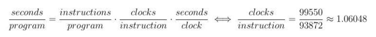
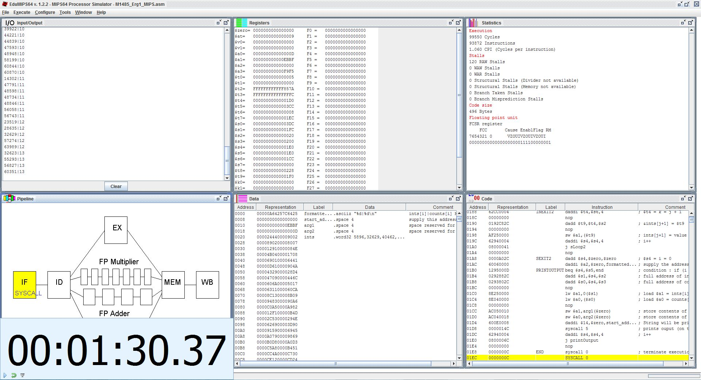

<h1 align="center">
	<a href="https://github.com/KeyC0de/SetBitSort">Set-Bit Sort in MIPS Assembly & C/C++</a>
</h1>

In this project we will dig deep into the MIPS64 architecture innards to understand the role of pipelining in a CPU. We'll be using the free & open source emulator EduMIPS64 which is written in Java. The emulator supports a subset (indeed the majority) of the MIPS64 architecture's instruction set repertoire. We will attempt to optimize and thus minimize the execution time of the program.

To test drive it, we will put together a program which processes an unsorted table of 120 signed integer numbers *x[i] (i=0, ..., 119)* and performs the following computation: 

* counts the number of ones (bit = 1) in the binary representation of each number and sorts them in increasing order of their number of one-bits. In case there are numbers with equal set-bits sort them in increasing order of their arithmetic value.

We won't be using console input for the numbers, they will reside in the file.

The following table sums up our finds:

 | Clock pulses |  Instruction Count | CPI (3 dec.) | Execution time (msec)
-------------|--------|--------|-------|------------------------
Measurements | 99,550 | 93,872 | 1.060 | 1m:30s:370ms = 90,370ms

The execution time has been found with (my own) manual precision given a free stopwatch Windows program I had at the time ([Free Stopwatch](https://free-stopwatch.com/) - I've written my own since). Thus to find the clock cycles per instruction we follow the fundamental equation:

	

I realized that to synthesize a fast and functional program I had to establish a sufficiently efficient algorithm, but at the same time not an overly complex one. Its linear complexity in C/C++ would mean exponential complexity in MIPS Assembly.

An algorithm goes hand in hand with its data structure. So I had to pick the ideal one to "welcome" our data (by the fire..). Initially I was wavering between arrays and structs. It was of crucial importance as I had to synchronize the elements inside 2, in fact, data arrays only considering the elements of 1 of them!

I had to use 2 arrays, there was nothing else left on the table. I name them:

1. `ints` : will be used to place the integers
2. `counts` : to store their set-bit counts

This shouldn't be too hard I thought (fast forward to now I was right). The algorithm I concluded on can be described below:

1. Generate 120 random integers and store them in array `ints`
	* loop for each element `i` of `ints` : `ints[i] = rand()`
2. find the amount of ones for each number in `ints` : `counts[i] = countOnes( ints[i] )`
3. sort numbers using insertion sort
4. `for each i = [0, 120) print( ints[i], ' ', counts[i])`

Step 3 contains the major part of the work. I will not explain the insertion sort algorithm. The hard part here is that we must sort two arrays simultaneously, first based on the values of `counts[i]` - I will name this Higher-priority sort - and second based on the values of `ints[i]` for every unique value in `counts[i]` (those must now be sorted already from the output of the first sort) - Lower-priority sort.

I began the implementation in the C language (it would be foolish of me to start it in Assembly firsthand!). Always start high level! That one you can find in the "printSorted1sMIPS.c". Its output I store in "printSorted1sMIPS_c.output". 

Later I ported the code to assembly. I have to point that EDUMIPS64 assembly has plenty of syntactical differences to regular MIPS64 assembly. I had to first become more familiar to the language. Thankfully there were a few examples that eased the process. Another important EDUMIPS64 difference is that the return value when we return from a function doesn't go to register $a0, $a1, $a*. I often found - by trial and error - that it was in $v0 or $v1. So I decided to put the entire code in the main function. I made sure the code is fully documented though and every logical reason clearly separated so it shouldn't be too hard to follow along. You can find the code in M1485_Erg1_MIPS.asm. I have further included my rough and dirty (but correct) notes while implementing the program in "drafts.7z". They might prove useful to you.

I will list below all the registers I used and the role they play. I have used almost the entire set or registers but I tried to be consistent as much as possible with their usage.

Register | Functionality
---------|--------------
$s2 = $18|`ints` base address
$s3 = $19|`counts` base address
$s4 = $20|array index `i`
$s5 = $21|array sizes (in bytes) = amount of elements * 4
$s6 = $22|index Mr. `j` indexes stuff inside nested loops
$s1 = $17|full address of element `i` in table `ints` (i.e. `&ints[i]` in C)
$s0 = $16|full address of element `i` in table `counts`
$a1 = $5|value of elements `i` in array `ints` (i.e. `ints[i]`)
$a0 = $4|value of elements `i` in array `counts` (i.e. `counts[i]`)
$t6 = $14|exclusive use for syscall 5 and terminal output
$at = $1|return value from system routines (not used)
$t5 = $13|address of element `j` in `counts` (`&counts[j]`)
$t7 = $15|address of element `j` in `ints` (`&ints[j]`)
$t8 = $16|address of element `j+1` in `counts`
$t9 = $17|address of element `j+1` in `ints`
$a2 = $6|value of element `j` in array `counts`
$a3 = $7|value of element `j` in array `ints`
$s7 = $23|value of elements `j+1` in array `counts`

I have placed the numbers I got from the C program output into the `.data` section of the program.

I should clarify how we get the address of an array element in order to store data in it in Assembly.

1. get array base address. for example in `ints`: `daddi $s2, $zero, ints` where $s2 contains `ints`'s base address
2. calculate offset from base address that the element we need lies. We can find that by the element's index `i` multiplied by the number of Bytes that each array element takes up. For an integer array for instance that would be 4 Bytes. Thus `4 * i` to get the offset. Indicatively `daddi $s4, $s4, 4`
3. add base address with the offset address to get `&ints[i]`. eg. `dadd $s1, $s4, $s2` so we store the address of the corresponding `ints[i]` in $s1.
4. load, or store a value to that address. Following with our example: `lw $a1, ($s1)` or `sw $a1, ($t9)`

As far as optimization is concerned I took the following precautions:

* array indices `i`, `j`, `k` etc. were increased each iteration by 4, not by (as we would be doing in a higher level language - C). Doing this we bypass the stage of multiplying it with some value to go to another element of the array
* register initialization occurred right before they were used
* As we know insertion sort complexity is O( (n^2)/2 ) in the average case. Comparing to other algorithms such as selection or bubble sort that always require O(n^2) I found it was a decent middle ground while still being easy to reason with as opposed to a faster algorithm like quick sort which is also more complicated.

The picture below shows a screenshot from executing the program. I used the statistics laid out here to complete the initial table properties. In EDUMIPS64 I had enabled forwarding and disabled the display of clock cycles since the program lagged unnaturally with this option on (no way around it as I contacted the lead developer at the time - even if I increased Java's heap memory during initialization of the program).

	

Last but not least a recurrent problem was the many read delays immediately after register writes - Read After Write (RAW) Hazards. Initially the program contained more than 1,000 of them. To decrease this delay I placed `nop` instructions around the these problematic-cases to minimize the hazards from the application.

# Contribute

Please submit any bugs you find through GitHub repository 'Issues' page with details describing how to replicate the problem. If you liked it or you learned something new give it a star, clone it, contribute to it whatever. Enjoy.

# License

Distributed under the GNU GPL V3 License. See "GNU GPL license.txt" for more information.

# Contact

email: nik.lazkey@gmail.com
website: www.keyc0de.net

# Acknowledgements

[EDUMIPS64](https://github.com/EduMIPS64/edumips64)
